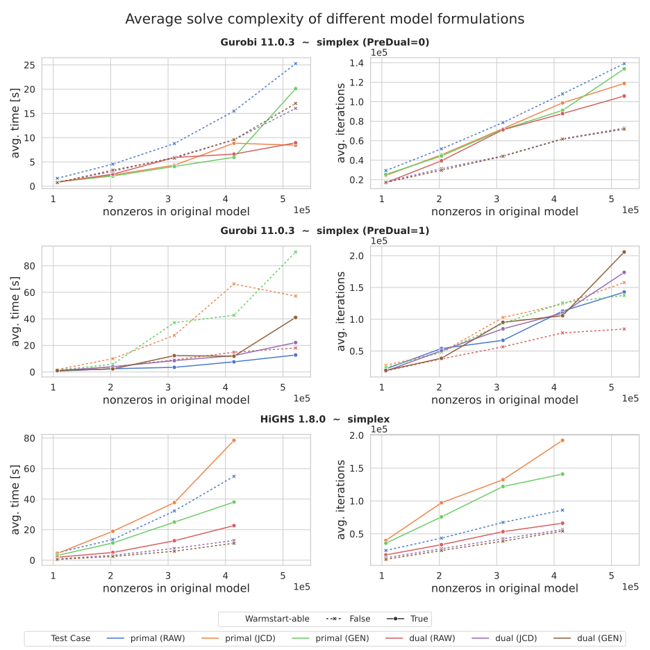
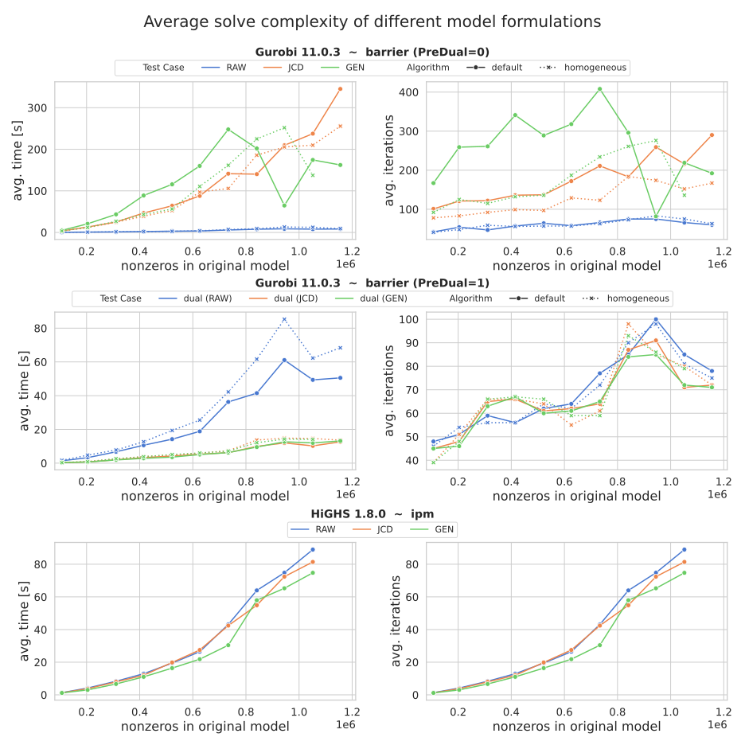

# Model 007

This is actually a collection of multiple models, all derived from the Calliope `national_scale` example model. They 
differ in their modeling period, from 1 month to covering the whole year.

See:

- `create_model/` for the code that created these models.
- `code.jl` for the code that implements this "experiment".
- `analyse_results/` for the code that is used to create plots and interpretations.

## Environment

All codes are accompanied by fixed Python/Julia dependencies. For Calliope (pre `v0.7`) the revision
36f62578c679f5503763857bb5ebfeb5cb49971f was used. Further, to match the (at the time) installed Gurobi license, its
version was fixed to `11.0.3` (at the time of writing version 12 was already available).

This was achieved by running the following with `uv`:

```shell
uv add git+https://github.com/calliope-project/calliope --rev=36f62578c679f5503763857bb5ebfeb5cb49971f
uv add gurobipy==11.0.3
```

## Code formatting

Code was formatted using `ruff`

```shell
uvx ruff format --line-length=120
```

```julia
using JuliaFormatter
format(".")
```

## Hardware

Final results where run on a machine with the following setup:

- Intel(R) Core(TM) i9-14900K, instruction set [SSE2|AVX|AVX2]
- 91.9G of RAM (according to `htop`)
- Ubuntu 24.10

## Experiments

- Experiments are (per default) run five times, results are then averaged over these runs.
- Dualization of a given model (obviously) takes time. This time is "unfairly" not included in test cases, whereas the time it takes Gurobi to apply `PreDual = 1` is of course included in the total solution time. However, this dualization step can be expected to be applied once (before starting decomposed solve), could be done in parallel, or even "re-used" (for sub-models that share the same structure and only differ in their parameterization). The application of `PreDual = 1` however would have to be "paid" every time.
- These experiments always consider a fresh solve; an algorithm that may be (considerably) slower on the first solve, but offers fast and efficient re-solves may be beneficial over all.
- Resulting plots are geared towards indicating which simplex algorithms might make use of warm starts.
- Simplex results obtained using HiGHS make use of the `PAMI` simplex algorithm, since it seems to perform marginally better than `SIP` (both outperform the serial simplex considerably). This can further be checked by running `df_results.groupby(["solver", "test_case"])["avg_sec"].mean()` in the analysis code.

**A note on warm starts:**  
Simplex algorithms (assuming a sub-model that is small enough to be solved) can efficiently be warm started based on the previous iteration's basis. The general rule of thumb applies:

- A primal simplex can account for updates in the objective function (e.g., coefficient changes like those appearing in basic MGA approaches).
- A dual simplex can account for changes in the right-hand side of the constraints (e.g., changes in installed capacities, triggered by a new main-model solution).

This (disregarding the effect of adding variables/constraints) can be summarized as: If the feasible region does not change, a warm start can be beneficial. This is the case for both examples given above; while obvious for the primal simplex, it can also be seen for the dual simplex: The changed primal right-hand side translates to a change of variable coefficients in the objective function of the dual problem (not modifying the feasible region of the dual).

### Numerical issues

Some experiments (mainly IPM solves of dual problems) result in numerical issues and can not be solved. For these the following steps are taken:

- Gurobi: `NumericalFocus` is set to its highest value (`3`); the model is re-solved; if it is still not solvable, `Presolve` is further deactivated (which makes the final re-solve extremely expensive).
- HiGHS: IPM solves that do not report an optimal result are most likely solved close to optimal with some violations; for these the returned solution (from `solver = "ipm"`) is used.

Note: Turning off presolve for HiGHS has been observed to (a) not fix the numerical issues, and (b) heavily increase solution times. This step is therefore only done for Gurobi.

The occurrence of this is documented in the results using the columns: `termination`, `numerical_issues`, and `presolve`. 

### Running experiments

1. `julia --project=. code.jl`
2. `uv run analyse_results/analyse_results_ipm.py`
3. `uv run analyse_results/analyse_results_simplex.py`

### Dualization

The possibility of observing variables fixed using identical bounds (`x_lower == x_upper`) is not considered.

## Results

Besides different solver settings / algorithms (compare `code.jl`), the following three "modes" are tested:

- `RAW`: Passing the model read from a given file directly to the solver (= in its primal form).
- `JCD`: Passing a dual form of the model, constructed after the description of [conic duality in the JuMP documentation](https://jump.dev/JuMP.jl/stable/moi/background/duality/).
- `GEN`: Passing a dual form of the model, constructed after a highly generalized form of LP duality, based on a [summary by Dabeen Lee](https://dabeenl.github.io/IE331_lecture9_note.pdf).

Note that the `JCD` formulation is also used by [Dualization.jl](https://jump.dev/Dualization.jl/dev/manual/#Conic-Duality-1), which is also used by [Decomposition.jl](https://github.com/sstroemer/Decomposition.jl).

The reference chosen for `GEN` is arbitrary - many others, and more "popular" ones exist. Many however only describe a subset of possible ways to write the primal form of the LP (e.g., only using $Ax = b$, or assuming non-negativity on all $x$, etc.). In the end, these formulations can all be translated into each other - but maybe inducing an additional "cost" (e.g., slack variables, etc.).

It is important to note that these results only - for a very specific subset of settings and choices - evaluate the (first) solution of a given model. Besides many others, an important, but harder to quantify in an isolated experiment, factor that is completely left out is the "quality" of the resulting dual solution. This might heavily influence the convergence of a, e.g., Benders decomposition.

### Plots




