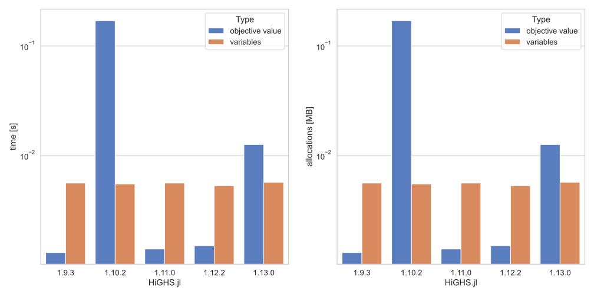
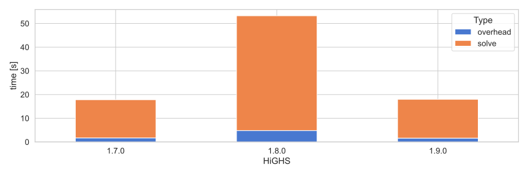

# 008

Execute the following commands to run the experiments:

```shell
julia --project=v192 code.jl
julia --project=v193 code.jl
julia --project=v1102 code.jl
julia --project=v1110 code.jl
julia --project=v1122 code.jl
julia --project=v1130 code.jl
```

Related links:

- [1](https://github.com/jump-dev/HiGHS.jl/issues/223)
- [2](https://github.com/jump-dev/HiGHS.jl/issues/207)
- [3](https://github.com/jump-dev/HiGHS.jl/pull/229)
- [4](https://github.com/ERGO-Code/HiGHS/pull/1978)

TODO: Mention `TimerOutputs.jl`

## Results




